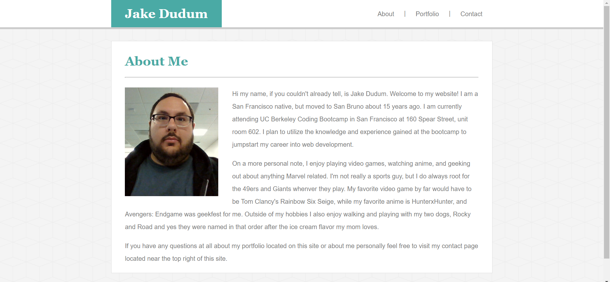
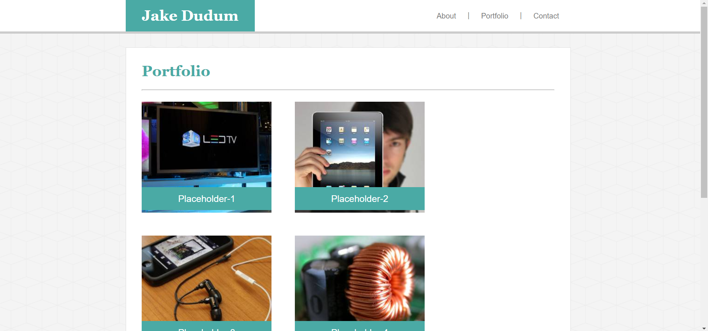
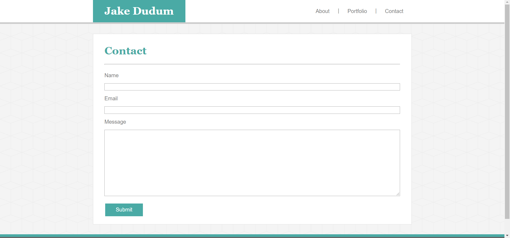
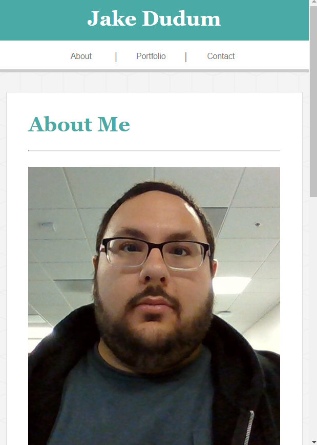
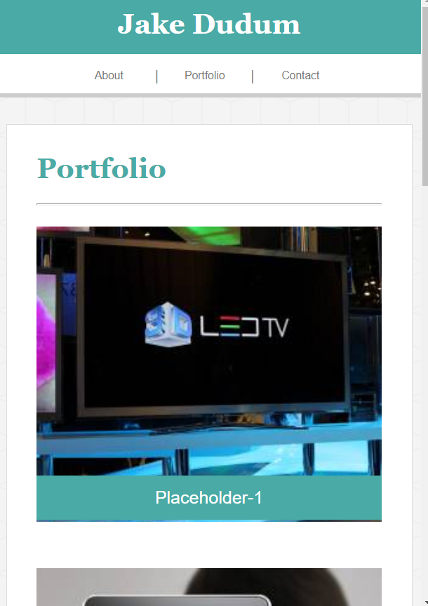
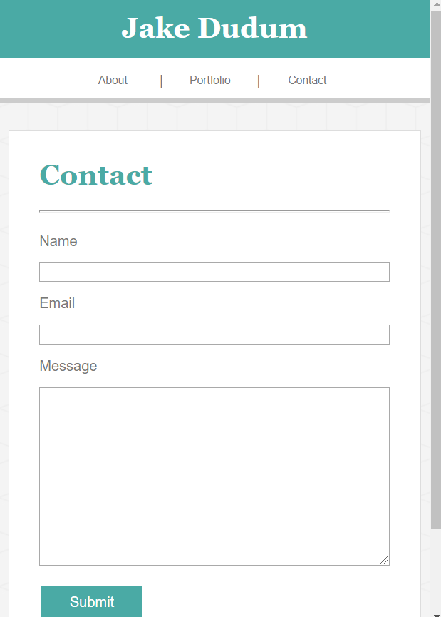

# Responsive-Portfolio

A carbon copy of my [Basic-Portfolio](https://jakedudum.github.io/Basic-Portfolio/), but with media queries for added responsiveness across different devices.

# Link to Deployed Site
- [Responsive-Portfolio](https://jakedudum.github.io/Responsive-Portfolio/)

# Built With
- [HTML](https://developer.mozilla.org/en-US/docs/Learn/HTML)
- [CSS](https://developer.mozilla.org/en-US/docs/Web/CSS)

# Versioning
- [Github](https://github.com/)

# Authors
### Jake Dudum

# Acknowledgments
- Darryl Tolentino for inspiration and idea bouncing